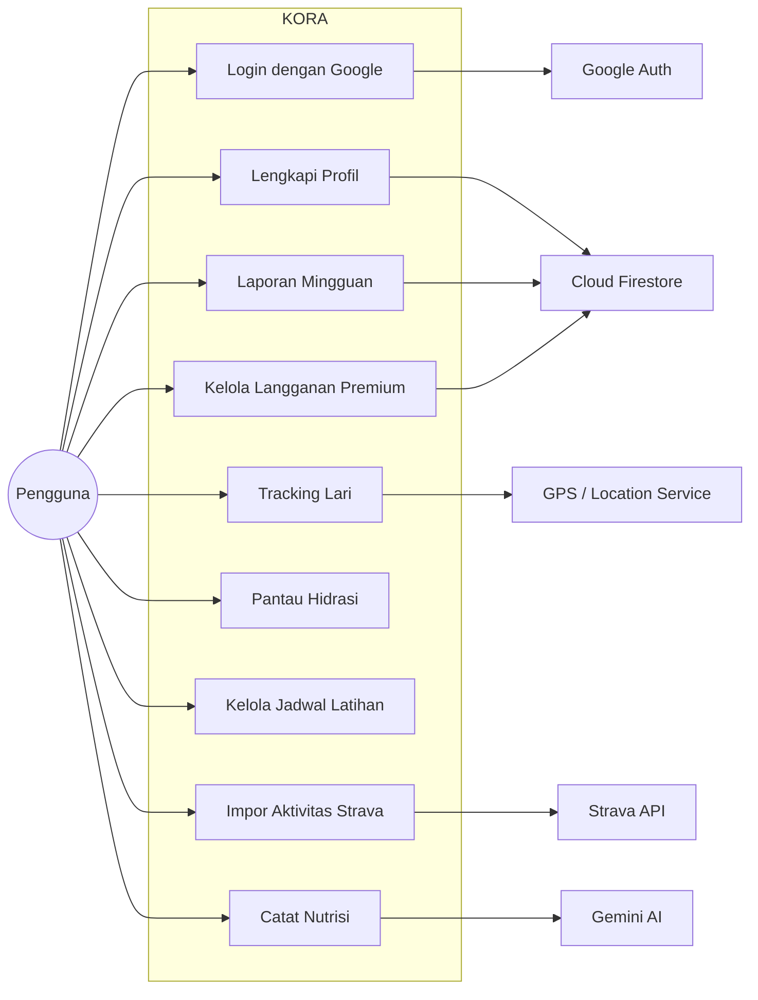
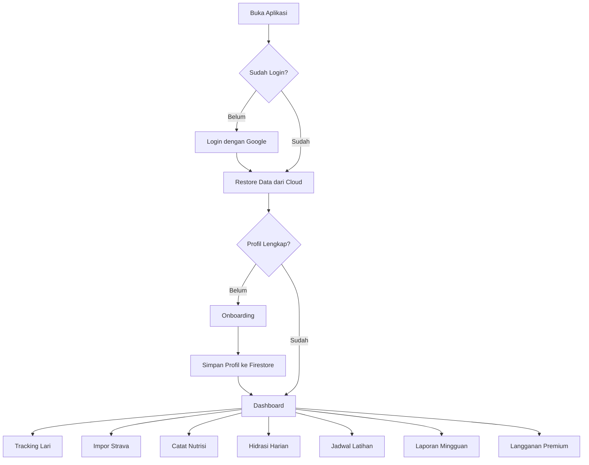
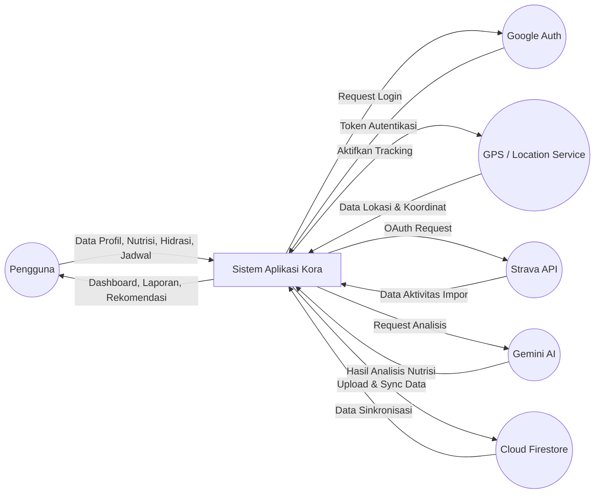
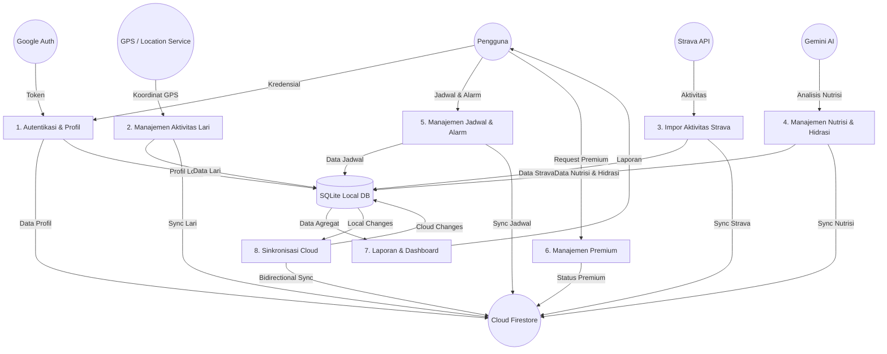
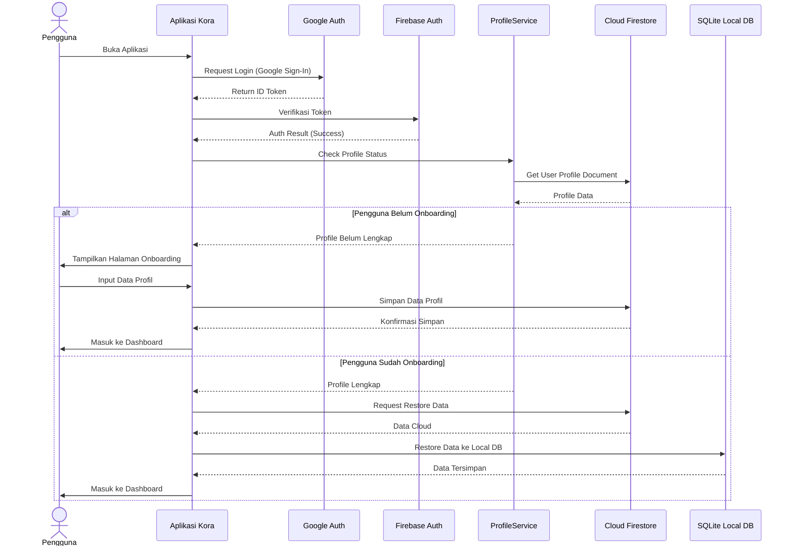
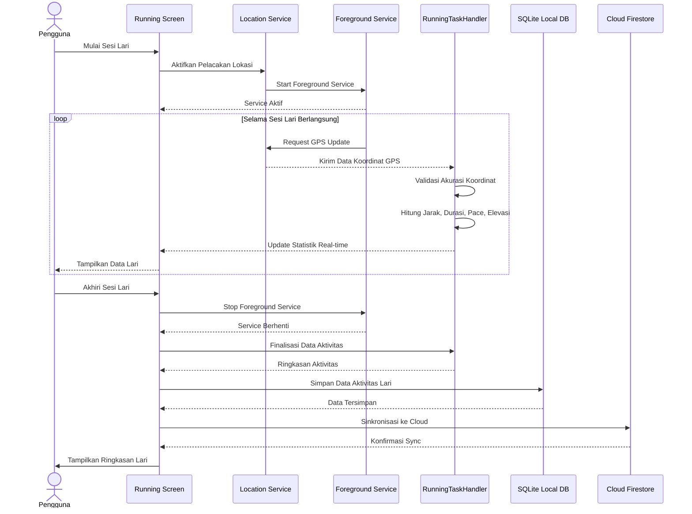

# Diagram Sistem Aplikasi Kora

---

### Gambar 1. Use Case Diagram Sistem Aplikasi Kora



Menggambarkan interaksi antara pengguna dengan fitur utama aplikasi Kora. Aktor utama pada sistem adalah pengguna, sedangkan aktor eksternal meliputi Google Auth, GPS/Location Service, Strava API, Gemini AI, dan Cloud Firestore. Pengguna dapat melakukan login, melengkapi profil, melacak aktivitas lari, mengimpor aktivitas dari Strava, mencatat nutrisi, memantau hidrasi, mengelola jadwal latihan, melihat laporan mingguan, dan mengelola langganan premium.

---

### Gambar 2. Flowchart Sistem Utama Aplikasi Kora



Menunjukkan alur utama aplikasi mulai dari pengguna membuka aplikasi, melakukan login, proses restore data dari cloud, pengecekan kelengkapan profil, onboarding, hingga masuk ke dashboard. Setelah berada pada dashboard, pengguna dapat memilih fitur seperti tracking lari, impor Strava, pencatatan nutrisi, hidrasi harian, jadwal latihan, laporan mingguan, atau langganan premium.

---

### Gambar 3. DFD Level 0 Sistem Aplikasi Kora



Merupakan diagram konteks yang menunjukkan hubungan antara Sistem Aplikasi Kora dengan entitas eksternal. Entitas eksternal yang terlibat adalah pengguna, Google Auth, GPS/Location Service, Strava API, Gemini AI, dan Cloud Firestore. Diagram ini menggambarkan aliran data utama seperti data profil, nutrisi, hidrasi, jadwal, tracking lari, autentikasi, data lokasi, analisis nutrisi, dan sinkronisasi cloud.

---

### Gambar 4. DFD Level 1 Sistem Aplikasi Kora



Memecah proses utama Sistem Aplikasi Kora menjadi beberapa proses internal, yaitu autentikasi dan profil, manajemen aktivitas lari, impor aktivitas Strava, manajemen nutrisi dan hidrasi, manajemen jadwal dan alarm, manajemen premium, laporan dan dashboard, serta sinkronisasi cloud. Diagram ini juga menunjukkan penggunaan SQLite sebagai basis data lokal dan Cloud Firestore sebagai basis data cloud.

---

### Gambar 5. Struktur Database Aplikasi Kora

```mermaid
erDiagram
    SQLite {
        table workout_activities {
            int id PK
            string type
            datetime date
            double duration
            double distance
            double calories
            string notes
        }
        table nutrition_entries {
            int id PK
            string food_name
            double protein_grams
            double calories
            double carbs_grams
            double fat_grams
            string meal_type
            datetime date
        }
        table hydration_entries {
            int id PK
            int water_ml
            datetime date
        }
        table schedule_entries {
            int id PK
            string title
            string type
            datetime date
            string reminder
        }
        table strava_activities {
            int id PK
            string strava_id
            string type
            double distance
            double duration
            datetime date
        }
        table body_measurements {
            int id PK
            double weight
            double body_fat
            datetime date
        }
        table workout_photos {
            int id PK
            int workout_id FK
            string photo_path
            datetime created_at
        }
    }

    Firestore {
        collection users {
            string uid PK
            map profile
            string email
            string display_name
        }
        collection userData {
            map workout_activities
            map nutrition_entries
            map hydration_entries
            map schedule_entries
            map strava_activities
            map body_measurements
            map premium_status
        }
    }

    SQLite ||--|| Firestore : "CloudSyncService bidirectional sync"
```

Menunjukkan struktur penyimpanan data pada aplikasi Kora. Aplikasi ini menggunakan pendekatan hybrid database, yaitu SQLite Local Database dan Cloud Firestore. Data aktivitas, nutrisi, hidrasi, jadwal, aktivitas Strava, dan pengukuran tubuh disimpan pada SQLite sebagai penyimpanan lokal. Data tersebut kemudian disinkronkan ke Cloud Firestore. Khusus data profil pengguna, sistem menggunakan pendekatan cloud-first melalui dokumen pengguna pada Firestore.

---

### Gambar 6. Sequence Diagram Login dan Onboarding Aplikasi Kora



Menggambarkan urutan interaksi pada proses login dan onboarding. Pengguna melakukan login melalui Google, kemudian sistem melakukan autentikasi menggunakan Firebase Authentication. Setelah login berhasil, ProfileService memeriksa data profil pada Cloud Firestore. Jika pengguna belum melakukan onboarding, sistem menampilkan halaman onboarding dan menyimpan data profil ke Firestore. Jika pengguna sudah melakukan onboarding, sistem melakukan restore data dari cloud ke SQLite sebelum masuk ke dashboard.

---

### Gambar 7. Sequence Diagram Tracking Lari Aplikasi Kora



Menunjukkan alur interaksi pada fitur tracking lari. Pengguna memulai sesi lari melalui halaman running, kemudian sistem mengaktifkan layanan pelacakan lokasi. Data GPS dikirim secara berkelanjutan ke RunningTaskHandler untuk divalidasi dan diolah menjadi statistik seperti jarak, durasi, pace, elevasi, dan rute. Setelah sesi selesai, data aktivitas disimpan ke SQLite dan disinkronkan ke Cloud Firestore.
